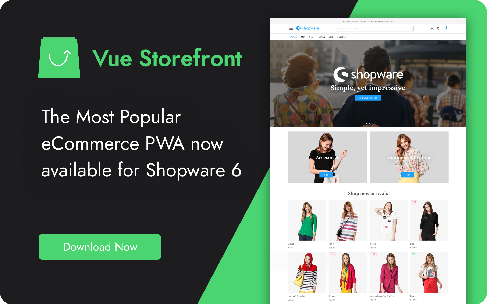
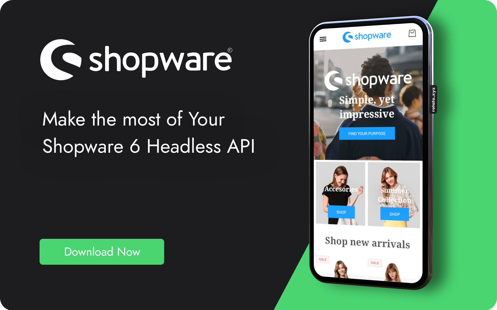
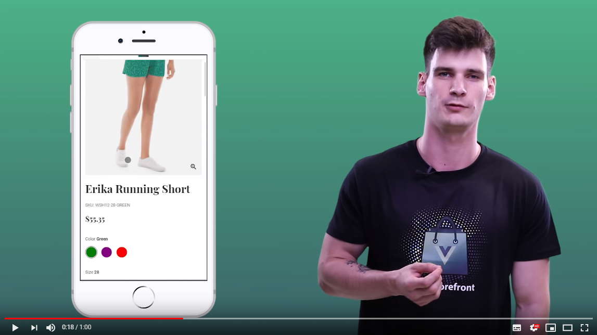
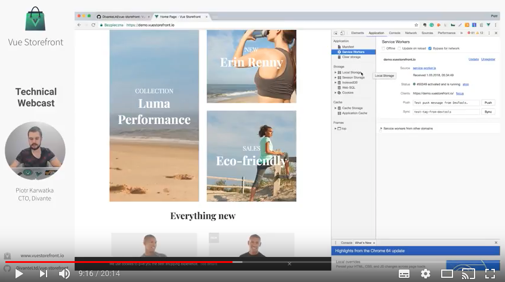

# Vue Storefront for Shopware 6
<a href="https://travis-ci.org/DivanteLtd/vue-storefront"></a>


<a href="https://join.slack.com/t/vuestorefront/shared_invite/enQtMzA4MTM2NTE5NjM2LTI1M2RmOWIyOTk0MzFlMDU3YzJlYzcyYzNiNjUyZWJiMTZjZjc3MjRlYmE5ZWQ1YWRhNTQyM2ZjN2ZkMzZlNTg"></a>

Vue Storefront is a extremly fast and customizable frontend framework for eCommerce. Based on Vue.js, leverages the Headless architecture approach. With Vue Storefront You could build the stunning UI interfaces, increase the Conversion Rates, improve the UX. **Now it's available for Shopware 6!**. 

**Make the eCommerce development Fun Again**. It's easy to do with Shopware 6 + Vue Storefront :-)

Made with ❤️ by [Vue Storefront](https://github.com/DivanteLtd/vue-storefront) team.



# What makes it unique?

This projects bring You the [Shopware 6](https://www.shopware.com) support as a backend platform for [Vue Storefront - first Progressive Web App for e-Commerce](https://vuestorefront.io).

Vue Storefront is a standalone PWA storefront for your eCommerce. It leverages the **Headless Architecture** and lets You make the most of the modern Shopware 6 Storefront API. 

**Here are the key characteristics of Vue Storefront for Shopware:**

- Full product, categories, attributes + multimedia indexing.
- Shopping cart with dynamic totals + promo rules applied,
- Checkout with the dynamic shipping methods and 'Cash on delivery' payment method,
- 100% offline support - via in-browser database + caching,
- High speed with local caching (Service Workers + IndexedDB); avg. server response time < 0.3s; avg client-side rendering time < 2s,
- Offline Orders support (via in-browser queue),
- Single Page App User Experience with Server Side Rendering support for SEO,
- Native app features - install on Home Screen (iOS, Android, Chrome), push notifications (via customization),
- NoSQL/ElasticSearch database backend,
- Modern Vue.js based frontend - easy to design and customize, atomic-design, design-system backed,
- It's a Framework - customizable via Extensions, Themes, easy to update with separated Core,



**This project is on the early stages of development. However it's probably OK for some limited production use :-) Expect some features that still requires development/bug fixing**

We do support most of the B2C features of Shopware 6 including:

Our To-Do list includes:
- Add support for configurable products (#4)
- Add the on-demand indexeing capabilities (#5)
- Add the order History support for the user account (#6)
- Add the support for online payment methods (#7)
- Add the CMS integration (#8)
- ...

**We are looking for contributors and agencies willing to join us and build the best Frontend Experience for Shopware!**

Read the [contributing guide](./CONTRIBUTING.md) and start by creating Your first Pull Request!

## See it in action

<table>
  <tbody>
    <tr>
      <td align="center" valign="middle">
        <a href="https://shopware.storefrontcloud.io">
          
        </a>
      </td>
      <td align="left" valign="top">
        Try out our open demo and if you like it <strong>first give us some star on Github ★</strong> and then contact us on <a href="https://slack.vuestorefront.io">Slack</a> or via contributors@vuestorefront.io. <br /><br /> This demo site is connected to <a href="http://shopware.vuestorefront.io">Shopware 6</a> with shopping carts and users synchronization so You can make an order (which unfortunatelly won't be shipped ;P). <br /><br />If You like to learn more or contribute please <a href="https://vuestorefront.io">do contact us</a>.
      </td>
    </tr>
  </tbody>
</table>

# How to try it?

Feel free to check out. In order to have the Shopware 6 PWA up and running on Your local host You need to install the Vue Storefront first.

## Install Vue Storefront
Please do install the [Vue Storefront](https://docs.vuestorefront.io/guide/installation/linux-mac.html#requirements) using the official Installer. Make Sure that Vue Storefront is running with the default demo database on `http://localhost:3000`

```sh
git clone https://github.com/DivanteLtd/vue-storefront.git vue-storefront
cd vue-storefront
yarn
yarn installer
```

## Download the Indexer and Api Extension
Vue Storefornt integration always requires two steps.

### First - Integrate the Dynamic Requests calls
... requests like user login, shopping cart synchronization must find out the way to Your Shopware 6 backend. Vue Storefront API is in charge of sending these requests and all You need is to setup the Shopware connector in it.

Download a [*.zip with the content of this](https://github.com/DivanteLtd/shopware2vuestorefront/archive/master.zip) repository (`vsf-api-extension` and `vsf-shopware-indexer`) and unpack the folders in the same parent directory Your `vue-storefront` and `vue-storefront-api` folders are located.

```
cd ..
wget https://github.com/DivanteLtd/shopware2vuestorefront/archive/master.zip
unzip master
```

Then, copy the content of `vsf-api-extension/*` to `vue-storefront-api/src/platform/shopware` 

```
mkdir vue-storefront-api/src/platform/shopware
cp vsf-api-extension/* vue-storefront-api/src/platform/shopware/
```

Change the `vue-storefront-api/config/local.json` setting the `platform` to `shopware`.
In the end - set the `Shopware 6` API credentials in the `vue-storefront-api/config/local.json`.


### Second - Configure indexer and index the products, categories and other static elements

The second part of the integration is product's catalog which should be indexed into ElasticSearch index - which is the local database Vue Storefront is using in order to display the product catalog.

Follow the instructions located in vsf-shopware-indexer/README.md and then move to the next steps:

Now, please do configure the `vsf-shopware-indexer` by copying the `vsf-shopware-indexer/config.js.dist` to `vsf-shopware-indexer/config.js` and setting the proper API credentials.
9. Install the dependencies: `cd vsf-shopware-indexer/; yarn install`
8. Now You need to index Your local ElasticSearch index with the products from Shopware instance by running the:

```sh
node vsf-shopware-indexer/cli.js reindex attribute
node vsf-shopware-indexer/cli.js reindex category
```
Take a look for the attributes' IDs (for instance: color and size), and put them into `vsf-shopware-indexer/config.js` in the map section, adn then: 

```sh
node vsf-shopware-indexer/cli.js reindex product
```

Then make sure You applied the proper data schema on Your brand-new Elastic index by running the:
`cd vue-storefront-api; yarn db rebuild`

## Restart Your Vue Storefront

Kill all Your node processes with the `killall node` (in order to apply the config changes).
Run the `yarn dev` command in both: `vue-storefront-api` and `vue-storefront` folders.

Please do [contact us](https://vuestorefront.io) in the case of any issues with the installation procedure.

# More on Vue Storefront

[](https://www.youtube.com/watch?v=L4K-mq9JoaQ)

## Technical Webcast #1 - demo and the architecture

[](https://www.youtube.com/watch?v=sRSmEP4jva0&feature=youtu.be)

# Join the community on Slack

If you have any questions or ideas feel free to join our slack: https://vuestorefront.slack.com via [invitation link](https://join.slack.com/t/vuestorefront/shared_invite/enQtMzA4MTM2NTE5NjM2LTI1M2RmOWIyOTk0MzFlMDU3YzJlYzcyYzNiNjUyZWJiMTZjZjc3MjRlYmE5ZWQ1YWRhNTQyM2ZjN2ZkMzZlNTg)

# Contributing

We are currently in a process of building the connector. If you want to help shaping future of Vue and Shopware we'd be more than happy if you want to contribute! [Here](./CONTRIBUTING.md) you can find all the required information.
